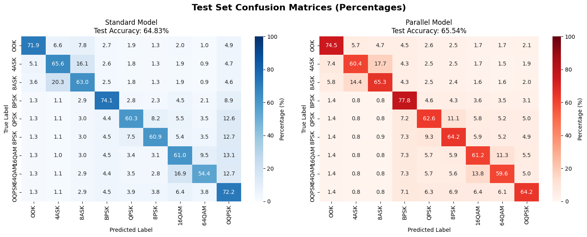
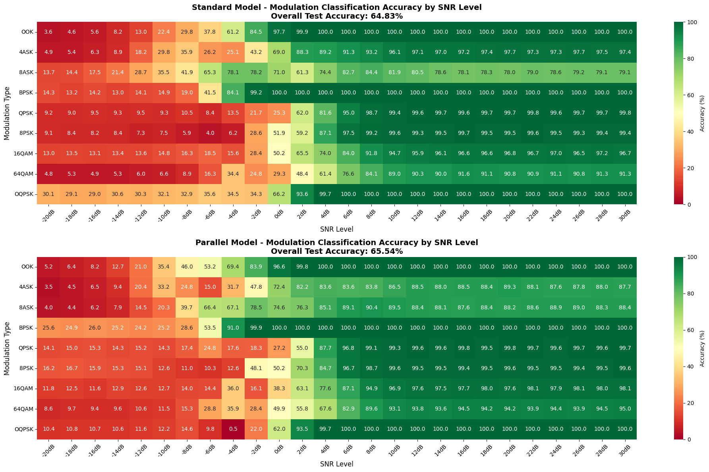
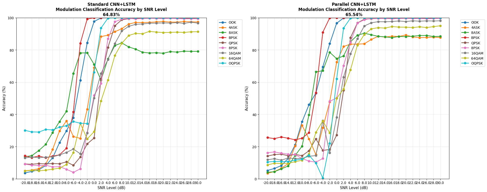
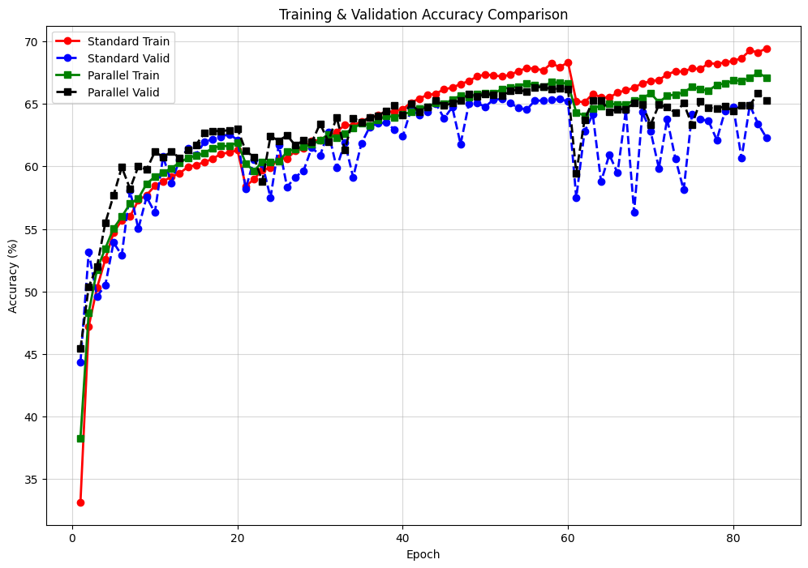

### New Log 

**Date:** 2025-July-30 
### Main Notebook 
    notebook yang digunakan untuk menguji kedua model ada di ./home_notebook/Compare_Model.ipynb
### Improvement Model : 
## Model CNN+LSTM Standart (Serial)

**Structure:** 
# Rincian Arsitektur Model CNN-LSTM Serial

| **Lapisan (Layer)** | **Dimensi Keluaran (Output Dimension)** | **Keterangan** |
|---------------------|------------------------------------------|----------------|
| **--- Cabang CNN (untuk I dan Q) ---** | | |
| Masukan (Input Signals I/Q) | `(1, 32, 32)` | Representasi sinyal 2D |
| Convolution2D (64 filter, 3x3) | `(64, 32, 32)` | Ekstraksi fitur awal |
| Convolution2D (64 filter, 3x3) | `(64, 32, 32)` | Ekstraksi fitur lanjutan |
| MaxPool2D (2x2) + Dropout | `(64, 16, 16)` | Reduksi dimensi & regularisasi |
| Convolution2D (128 filter, 3x3) | `(128, 16, 16)` | Ekstraksi fitur kompleks |
| Convolution2D (128 filter, 3x3) | `(128, 16, 16)` | Ekstraksi fitur kompleks |
| MaxPool2D (2x2) + Dropout | `(128, 8, 8)` | Reduksi dimensi & regularisasi |
| AdaptiveAvgPool2D | `(128, 8, 8)` | Penyesuaian dimensi spasial |
| **--- Pemrosesan Sekuensial ---** | | |
| Reshape untuk LSTM | `(64, 128)` | Mengubah fitur menjadi sekuens |
| LSTM (100 unit) | `(64, 100)` | Mempelajari dependensi temporal |
| LSTM (50 unit) | `(64, 50)` | Mempelajari dependensi temporal |
| Global Attention | `50` | Pembobotan fitur temporal |
| **--- Fusi dan Klasifikasi ---** | | |
| Fusi Fitur (Penjumlahan I + Q) | `50` | Menggabungkan fitur dari I dan Q |
| Dense + LeakyReLU | `256` | Lapisan terhubung penuh pertama |
| Dropout | `256` | Regularisasi |
| Dense + LeakyReLU | `128` | Lapisan terhubung penuh kedua |
| Dropout | `128` | Regularisasi |
| Dense + LeakyReLU | `64` | Lapisan terhubung penuh ketiga |
| Dense + Softmax (Output) | `8` | Lapisan klasifikasi akhir |

## Model CNN+LSTM Parallel 
**Structure:** 
# Rincian Arsitektur Model CNN-LSTM Paralel

| **Lapisan (Layer)** | **Dimensi Keluaran (Output Dimension)** | **Keterangan** |
|---------------------|------------------------------------------|----------------|
| **--- Input Sinyal ---** | | |
| Masukan (Input Signals I/Q) | `(1, 32, 32)` | Representasi sinyal 2D |
| **--- Cabang CNN_1 (Shallow) ---** | | |
| Convolution2D (64 filter, 3×3) | `(64, 32, 32)` | Ekstraksi fitur awal |
| Convolution2D (128 filter, 3×3) | `(128, 32, 32)` | Ekstraksi fitur lanjutan |
| MaxPool2D (2×2) + Dropout | `(128, 16, 16)` | Reduksi dimensi & regularisasi |
| AdaptiveAvgPool2D | `(128, 1, 1)` | Global average pooling |
| Flatten | `128` | Linearisasi fitur |
| **--- Cabang CNN_2 (Deep) ---** | | |
| Convolution2D (64 filter, 3×3) | `(64, 32, 32)` | Ekstraksi fitur awal |
| Convolution2D (128 filter, 3×3) | `(128, 32, 32)` | Ekstraksi fitur menengah |
| MaxPool2D (2×2) + Dropout | `(128, 16, 16)` | Reduksi dimensi & regularisasi |
| Convolution2D (256 filter, 3×3) | `(256, 16, 16)` | Ekstraksi fitur kompleks |
| Convolution2D (256 filter, 3×3) | `(256, 16, 16)` | Ekstraksi fitur kompleks |
| MaxPool2D (2×2) + Dropout | `(256, 8, 8)` | Reduksi dimensi & regularisasi |
| AdaptiveAvgPool2D | `(256, 1, 1)` | Global average pooling |
| Flatten | `256` | Linearisasi fitur |
| **--- Fusi Fitur & Pemrosesan LSTM ---** | | |
| Concatenation (CNN_1 + CNN_2) | `384` | Penggabungan fitur paralel |
| Reshape untuk LSTM | `(1, 384)` | Mengubah untuk input LSTM |
| LSTM (256 unit) | `(1, 256)` | Mempelajari dependensi temporal |
| Dropout | `(1, 256)` | Regularisasi |
| LSTM (128 unit) | `(1, 128)` | Mempelajari dependensi temporal |
| Last Time Step | `128` | Ekstraksi fitur temporal terakhir |
| Dense (Output per cabang) | `9` | Klasifikasi per cabang I/Q |
| **--- Fusi Cabang I/Q ---** | | |
| I-Branch Output | `9` | Hasil klasifikasi cabang I |
| Q-Branch Output | `9` | Hasil klasifikasi cabang Q |
| Average Fusion | `9` | Rata-rata dari kedua cabang |
| Softmax (Output Final) | `9` | Klasifikasi akhir |

### TARGET MODULATION : 
Target Modulasi : [OOK, 4ASK, 8ASK,BPSK, QPSK, 8PSK, OQPSK ,16QAM, 64QAM]
## Karakteristik Data

Dataset yang digunakan memiliki spesifikasi teknis sebagai berikut:

### Spesifikasi Teknis Dataset

| **Parameter** | **Nilai** | **Keterangan** |
|---------------|-----------|----------------|
| Jumlah Kelas | 9 | Jenis modulasi yang diklasifikasi |
| Kanal Input | 2 | Komponen I dan Q |
| Panjang Sekuens | 1024 | Sampel per sinyal |
| Format Sinyal | I/Q kompleks | Representasi baseband |
| Ukuran Batch | 512 | Sampel per batch training |
| Jumlah Epoch | 300 | Iterasi training |
| Pembagian Data | 70-15-15 | Train-Validation-Test (%) |

**Catatan:** Range SNR yang digunakan dalam dataset ini adalah -20 dB hingga +30 dB sesuai dengan Karakteristik Dataset RadioML2018.01A

## Struktur Data I/Q

Setiap sampel data terdiri dari:

- **Komponen I (In-phase):** Bagian real dari sinyal kompleks
- **Komponen Q (Quadrature):** Bagian imajiner dari sinyal kompleks  
- **Panjang Sinyal:** 1024 sampel untuk setiap komponen
- **Label Kelas:** Indeks numerik (0-8) untuk jenis modulasi

## Pembagian Dataset

Dataset dibagi menggunakan strategi **70-15-15** untuk memastikan evaluasi yang robust:

### Pembagian Dataset per Batch

| **Subset** | **Persentase** | **Sampel per Batch** | **Tujuan** |
|------------|----------------|----------------------|------------|
| Training | 70% | 358 | Pembelajaran model |
| Validation | 15% | 77 | Tuning hyperparameter |
| Testing | 15% | 77 | Evaluasi akhir |
| **Total** | **100%** | **512** | **Satu batch lengkap** |

### CONFUSION MATRIX 
 
### Heatmap Overall Accuracy Each Modulation with each SNR level 

### CURVA Overall Accuracy Each Modulation with each SNR level 
 
### Curva Training Two Model 

### t-SNE Visualization 

